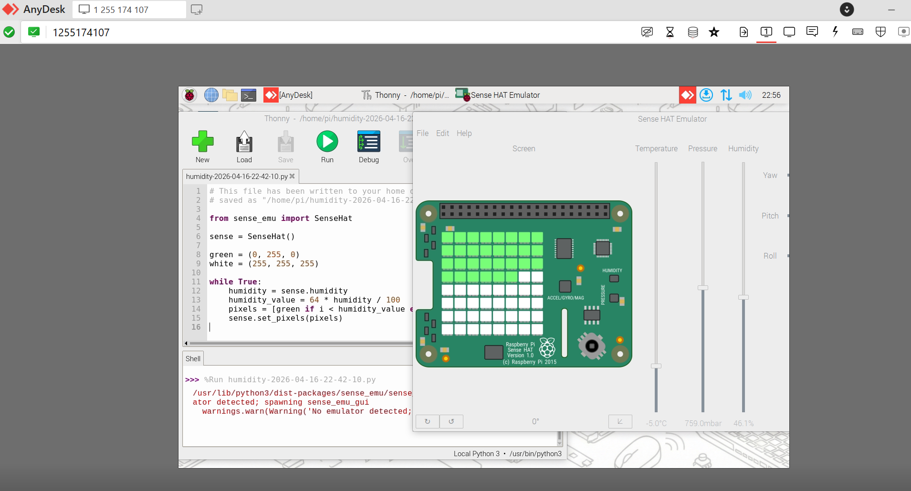
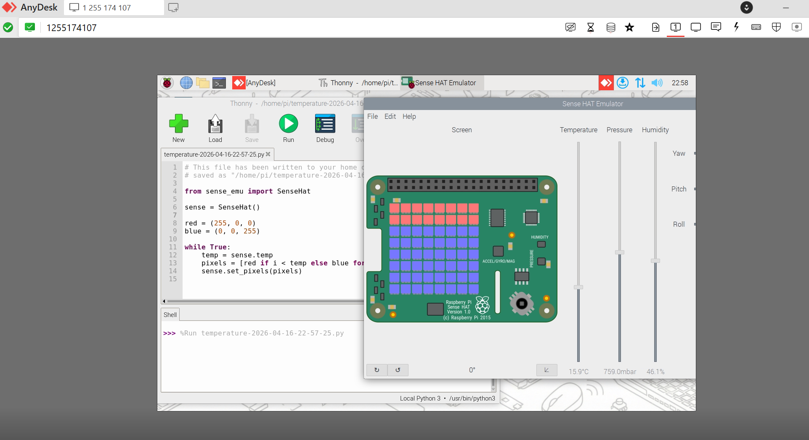
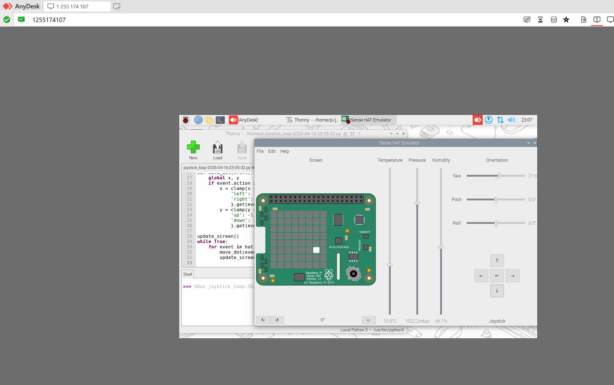
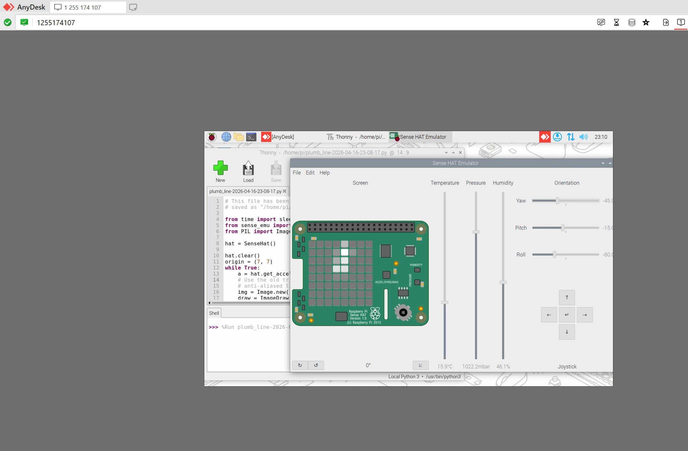
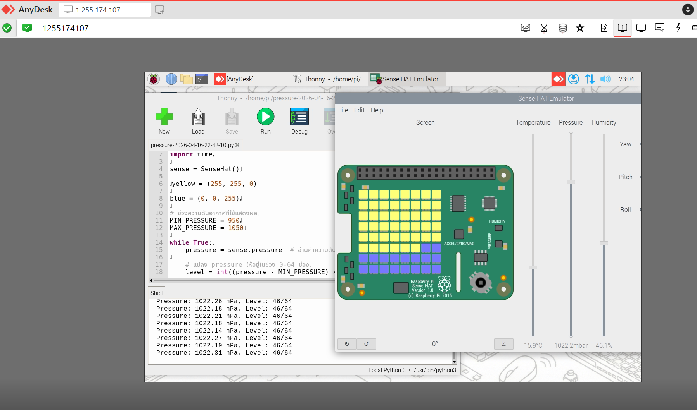
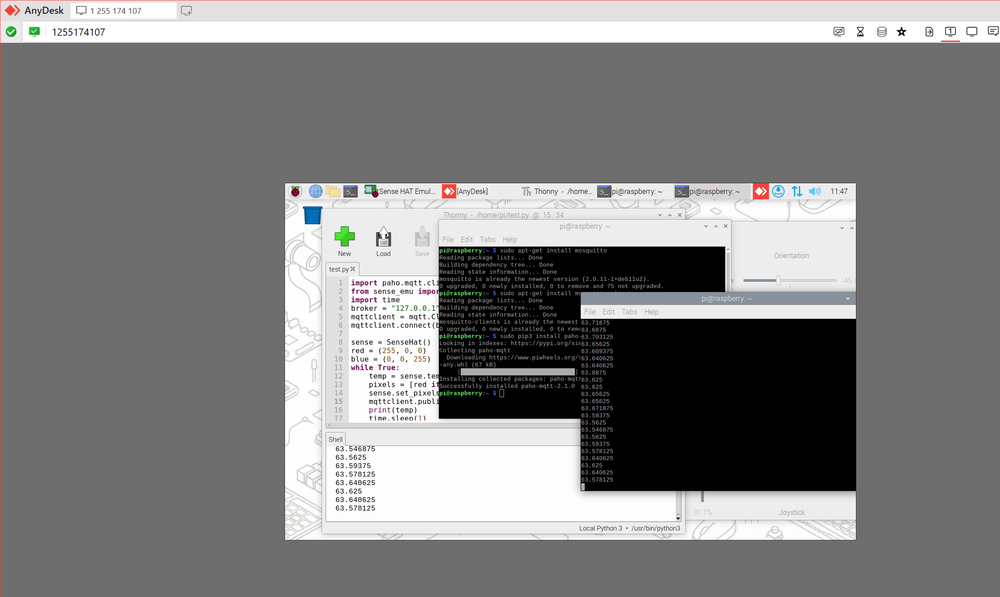
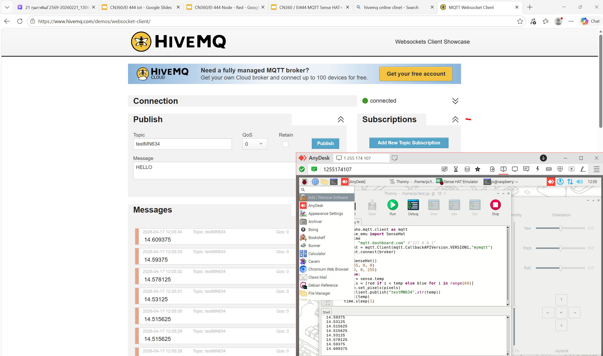

1 raspberry pi desktop
ทดลอง login เข้าไปใช้งาน จาก anydesk

ผลการทดลอง

2 sense hat
ทดลองอ่านค่า sensor ต่าง ๆ ที่มีอยู่ให้ครบทุกอัน
ทดลองแสดงผล out led

ตัวอย่างการอ่านผลการทดลอง

3 python on raspberry pi
เขียนโปรแกรม ด้วย python เพื่อทำตัวอย่างตามข้อสอง

ตัวอย่างการเขียน python เพื่อแสดงความดัน ไฟลชื่่อ pressure.py

4 mqtt client - server (broker) on local computer (pi)
ติดตั้ง  mqtt client/server ทดลองใช้
ติดตั้ง mqtt python library
ทดลองส่งข้อมูล sensor ทั้งหมด ไปที่ mqttlocal, mqtt on cloud

5 node-red
ติดตั้ง node-red
ส่งข้อมูล sensor จาก sense hat มาที่ node red

video ครับ
[sense hat to node red.mp4](./images/sense%20hat%20to%20node%20red.mp4)

6 thingsboard
sense hat -> node red -> thingsboard
แสดงผล sensors ทั้งหมด บนหน้าจอ dashboard
ควบคุมการเปิดปิด led ทั้ง 64 ดวงได้

video ครับ
[sense hat to node red to thinkboard.mp4](./images/sense%20hat%20to%20node%20red%20to%20thinkboard.mp4)
